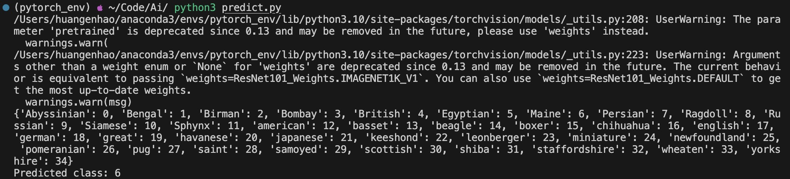
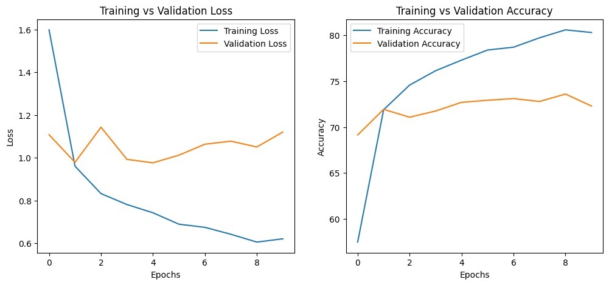
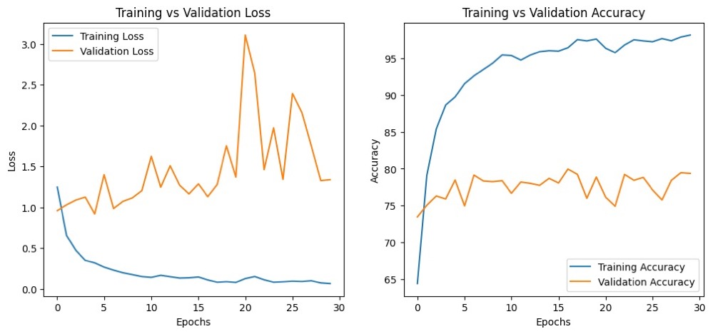
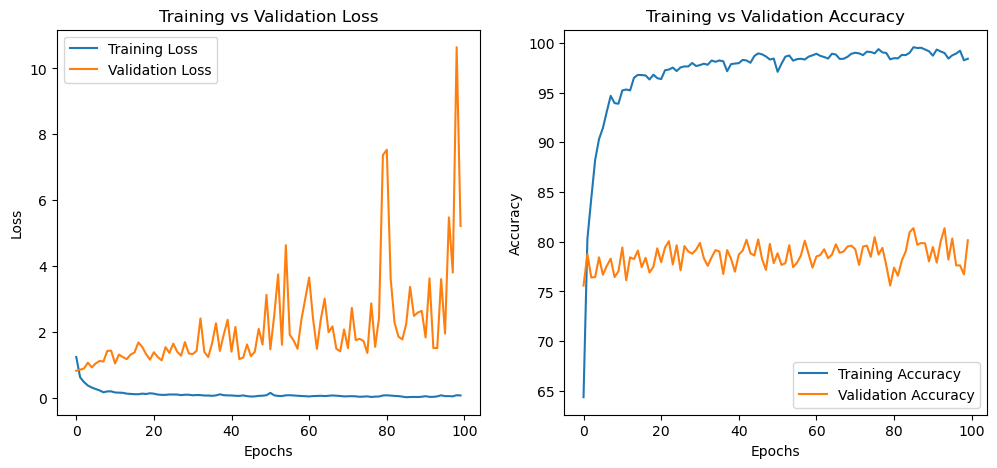

# 基于卷积神经网络的宠物品种识别系统

[TOC]

## 项目简介

### 实现功能

根据用户提供的图片，对常见的猫、狗品种进行检测

### 项目结构

```
|----Readme.md
|
|----code
|     |----Readme.md
| 	  |----Variety_identification1.py
|	  |----Variety_identification2.py
| 	  |----Variety_identification3.py
| 	  |----Predict.py
| 	  |----model_weights.pth
|     |----Index.html
|	  |----Flask.py
|
|----data
|	  |----test
|	  |		|----Abyssinian
|	  |		|----american
|	  |		|---- ......
|	  |
|     |----train
|			|----Abyssinian
|			|----american
|			|---- ......
|
|----demo
|	  |----cat
|	  |----dog
|
|----document
	  |----report.pdf
```


## 研发过程

### 1.0版本 `Variety_identification1.py`

- 总体思路

  - 定义基本的卷积神经网络进行训练

- 测试结果

  

### 2.0版本 `Variety_identification2.py`

- 改进思路

  - 增加ResNet101。ResNet的核心概念是残差连接（或跳跃连接），它允许输入直接跳过一个或多个层次。在残差块中，输入不仅连接到下一层，还连接到更深的层次。这种结构有助于解决梯度消失问题，成功训练更加深层的网络。
  - 输出训练结果折线图

- 测试结果

  

### 3.0版本 `Variety_identification3.py`

- 改进思路

  - 运用RTX 3070显卡增加训练轮次
  - 使用更大的数据增强

- 测试结果

  - `M1芯片，30轮次`

    

  - `RTX 3070，100轮次`

    


## 代码详析

本部分将基于3.0版本的代码进行详析

### 导入库

- 导入了`torch`、`torch.nn`、`torch.optim`等PyTorch核心模块，用于构建和训练神经网络。
- 使用`torchvision`加载和转换图像数据。
- 导入`PIL.Image`处理图像，`matplotlib.pyplot`进行图形展示。

```python
import torch
import torch.nn as nn
import torch.optim as optim
from torchvision import datasets, transforms, models
from torch.utils.data import DataLoader
from PIL import Image, UnidentifiedImageError
import matplotlib.pyplot as plt
```

### 模型初始化 (`initialize_model` 函数)

- 加载预训练的ResNet101模型。
- 解冻特定层（`layer4`和`fc`），以便在训练过程中更新这些层的权重。
- 替换最后的全连接层（`fc`），以匹配目标类别的数量。

```python
def initialize_model(num_classes):
    # 加载预训练的 ResNet101 模型
    model = models.resnet101(pretrained=True)

    # 解冻特定的层以便在训练过程中更新它们的权重
    for name, param in model.named_parameters():
        if "layer4" in name or "fc" in name:
            param.requires_grad = True
        else:
            param.requires_grad = False

    # 获取模型全连接层的输入特征数，并替换为新的全连接层
    num_ftrs = model.fc.in_features
    model.fc = nn.Linear(num_ftrs, num_classes)
    return model
```

### 数据预处理

- 加载预训练的ResNet101模型。
- 解冻特定层（`layer4`和`fc`），以便在训练过程中更新这些层的权重。
- 替换最后的全连接层（`fc`），以匹配目标类别的数量。

```python
# 定义训练数据的转换
train_transform = transforms.Compose([
    transforms.Resize((128, 128)),              # 将图像大小调整为128x128
    transforms.RandomHorizontalFlip(),          # 随机水平翻转图像
    transforms.RandomRotation(10),              # 随机旋转图像最多10度
    transforms.RandomCrop(128, padding=4),      # 随机裁剪图像
    transforms.ColorJitter(brightness=0.1, contrast=0.1), # 随机调整图像的亮度和对比度
    transforms.ToTensor(),                      # 将图像转换为Tensor
    transforms.Normalize(mean=[0.485, 0.456, 0.406], std=[0.229, 0.224, 0.225]) # 归一化图像
])

# 定义测试数据的转换
test_transform = transforms.Compose([
    transforms.Resize((128, 128)),              # 将图像大小调整为128x128
    transforms.ToTensor(),                      # 将图像转换为Tensor
    transforms.Normalize(mean=[0.485, 0.456, 0.406], std=[0.229, 0.224, 0.225]) # 归一化图像
])
```

### 自定义数据集类 (`CustomImageFolder`)

- 继承自`datasets.ImageFolder`，用于加载图像数据。
- 重写`__getitem__`方法，增加对损坏图像的处理，跳过损坏的图片。

```python
# 自定义图像数据集类，处理损坏的图像
class CustomImageFolder(datasets.ImageFolder):
    def __getitem__(self, index):
        while True:
            try:
                # 尝试获取图像及其标签，如果成功则返回
                image, label = super(CustomImageFolder, self).__getitem__(index)
                return image, label
            except UnidentifiedImageError:
                # 如果遇到损坏的图像，则跳过该图像
                print(f"跳过索引 {index} 处的损坏图片。")
                index = (index + 1) % len(self)
```

### 数据加载

- 创建训练和测试数据集实例。
- 使用`DataLoader`加载数据，设置批处理大小和是否打乱数据。

```python
# 创建训练和测试数据集
train_data = CustomImageFolder(root='data/train/', transform=train_transform)
test_data = CustomImageFolder(root='data/test/', transform=test_transform)

# 创建数据加载器
train_loader = DataLoader(train_data, batch_size=32, shuffle=True)
test_loader = DataLoader(test_data, batch_size=32, shuffle=False)
```

### 模型、优化器、损失函数和学习率调度器

- 将模型发送到指定的设备。
- 定义优化器（`Adam`），使用不同的学习率对不同层进行优化。
- 定义损失函数（交叉熵损失）。
- 定义学习率调度器，根据验证损失调整学习率。

```python
# 创建训练和测试数据集
train_data = CustomImageFolder(root='data/train/', transform=train_transform)
test_data = CustomImageFolder(root='data/test/', transform=test_transform)

# 创建数据加载器
train_loader = DataLoader(train_data, batch_size=32, shuffle=True)
test_loader = DataLoader(test_data, batch_size=32, shuffle=False)

# 设置计算设备
device = torch.device("mps")

# 初始化模型并将其转移到计算设备上
model = initialize_model(num_classes=37).to(device)

# 加载预先保存的模型权重
model.load_state_dict(torch.load('model_weights.pth', map_location=device))

# 设置模型为评估模式
model.eval()

# 使用不同的学习率为不同的模型层定义优化器
optimizer = optim.Adam([
    {'params': model.fc.parameters(), 'lr': 1e-3},   # 为全连接层使用较高的学习率
    {'params': model.layer4.parameters(), 'lr': 1e-4} # 为layer4层使用较低的学习率
], lr=1e-5)

# 定义损失函数
criterion = nn.CrossEntropyLoss()

# 定义学习率调度器
scheduler = optim.lr_scheduler.ReduceLROnPlateau(optimizer, 'min')

# 设置训练的周期数
num_epochs = 30

# 初始化存储训练和验证损失和准确率的列表
train_losses = []
train_accuracies = []
val_losses = []
val_accuracies = []
```

**注意：`mps` 是Pytorch基于Mac M系列芯片的优化硬件名称，如果使用其他系统，可以定义为 `cpu` 或者 `cuda`，具体详见本地的Pytorch配置**

### 训练和验证循环

- 对模型进行多个周期（epoch）的训练。
- 在每个epoch中，计算训练损失和准确率，然后在验证集上评估模型。
- 使用`matplotlib`绘制训练和验证过程中的损失和准确率变化图。

```python
# 训练循环
for epoch in range(num_epochs):
    # 设置模型为训练模式
    model.train()
    
    # 初始化累计变量
    running_loss = 0.0
    correct = 0
    total = 0

    # 遍历训练数据
    for i, (images, labels) in enumerate(train_loader):
        # 将数据传输到计算设备上
        images, labels = images.to(device), labels.to(device)

        # 优化器梯度归零
        optimizer.zero_grad()

        # 前向传播
        outputs = model(images)

        # 计算损失
        loss = criterion(outputs, labels)

        # 反向传播和优化
        loss.backward()
        optimizer.step()

        # 累计损失和准确率
        running_loss += loss.item()
        _, predicted = torch.max(outputs.data, 1)
        total += labels.size(0)
        correct += (predicted == labels).sum().item()
    
    # 计算并存储平均训练损失和准确率
    train_losses.append(running_loss / len(train_loader))
    train_accuracies.append(100 * correct / total)

    # 验证模型
    model.eval()
    val_running_loss = 0.0
    correct = 0
    total = 0
    with torch.no_grad():
        for images, labels in test_loader:
            images, labels = images.to(device), labels.to(device)
            outputs = model(images)
            loss = criterion(outputs, labels)
            val_running_loss += loss.item()
            _, predicted = torch.max(outputs.data, 1)
            total += labels.size(0)
            correct += (predicted == labels).sum().item()
    
    val_losses.append(val_running_loss / len(test_loader))
    val_accuracies.append(100 * correct / total)

    # 打印每个周期的训练和验证结果
    print(f'Epoch [{epoch+1}/{num_epochs}], Loss: {train_losses[-1]:.4f}, Val Loss: {val_losses[-1]:.4f}, Accuracy: {train_accuracies[-1]:.2f}%, Val Accuracy: {val_accuracies[-1]:.2f}%')
    
# 绘制训练和验证损失以及准确率的比较图
plt.figure(figsize=(12, 5))
plt.subplot(1, 2, 1)
plt.plot(train_losses, label='Training Loss')
plt.plot(val_losses, label='Validation Loss')
plt.title("Training vs Validation Loss")
plt.xlabel("Epochs")
plt.ylabel("Loss")
plt.legend()

plt.subplot(1, 2, 2)
plt.plot(train_accuracies, label='Training Accuracy')
plt.plot(val_accuracies, label='Validation Accuracy')
plt.title("Training vs Validation Accuracy")
plt.xlabel("Epochs")
plt.ylabel("Accuracy")
plt.legend()

plt.show()

```

### 保存训练参数

- 将模型训练参数输出到 `model_weights.pth` 文件

```python
# 保存训练参数
torch.save(model.state_dict(), 'model_weights.pth')
```

### 附件：伪代码

```pseudocode
Import necessary PyTorch and other libraries

Define function initialize_model(num_classes):
    Load a pretrained ResNet101 model
    Unfreeze specific layers (layer4 and fc) of the ResNet101
    Modify the model's fully connected layer to fit new number of classes
    Return the modified model

Define transformations for training data, train_transform:
    Include resizing, random horizontal flipping, random rotation, random cropping, color jitter
    Convert to tensor
    Normalize with specified mean and standard deviation

Define transformations for testing data, test_transform:
    Resize
    Convert to tensor
    Normalize with specified mean and standard deviation

Define a custom dataset class CustomImageFolder inheriting from datasets.ImageFolder:
    Override the __getitem__ method
    Try to get image and label
        If UnidentifiedImageError occurs, skip the corrupted image
        Repeat until a valid image is found

Load training and testing data using CustomImageFolder with respective transformations

Create DataLoader for training and testing data with specified batch size and shuffling

Set the computing device (e.g., GPU)

Initialize the model with the required number of classes and transfer it to the computing device

(Optional) Load pre-saved model weights

Set the model to evaluation mode

Define an optimizer with different learning rates for different layers of the model

Define the loss function (CrossEntropyLoss)

Define a learning rate scheduler (ReduceLROnPlateau)

Set the number of training epochs

Initialize lists to store training losses, accuracies, validation losses, and accuracies

For each epoch in the total number of epochs:
    Set the model to training mode
    Initialize variables for running loss and accuracy metrics
    For each batch of images and labels in the training DataLoader:
        Transfer images and labels to the computing device
        Clear the gradients of the optimizer
        Forward pass (compute the output of the model on images)
        Compute the loss
        Backward pass (compute gradients)
        Update model parameters
        Update running loss and accuracy metrics
    Calculate and store the average training loss and accuracy
    Evaluate the model on validation data:
        Set the model to evaluation mode
        With gradients disabled,
            Initialize variables for validation loss and accuracy metrics
            For each batch of images and labels in the testing DataLoader:
                Transfer images and labels to the computing device
                Forward pass
                Compute the loss
                Update validation loss and accuracy metrics
    Calculate and store the average validation loss and accuracy
    Print the epoch's results

    (Optional) Adjust learning rate based on validation loss using the scheduler

Plot training vs validation losses and accuracies using matplotlib
```


## 检测实例

在拥有了训练出来的参数后，接下来需要编辑检测程序

`predict.py`

```python
from PIL import Image
import torch
import torch.nn as nn
import torch.optim as optim
from torchvision import datasets, transforms, models
from torch.utils.data import DataLoader
from PIL import Image, UnidentifiedImageError
import matplotlib.pyplot as plt

def initialize_model(num_classes):
    model = models.resnet101(pretrained=True)

    # 解冻部分层
    for name, param in model.named_parameters():
        if "layer4" in name or "fc" in name:
            param.requires_grad = True
        else:
            param.requires_grad = False

    num_ftrs = model.fc.in_features
    model.fc = nn.Linear(num_ftrs, num_classes)
    return model

device = torch.device("mps")
model = initialize_model(num_classes=37).to(device)
model.load_state_dict(torch.load('model_weights.pth', map_location=device))
model.eval()

test_transform = transforms.Compose([
    transforms.Resize((128, 128)),
    transforms.ToTensor(),
    transforms.Normalize(mean=[0.485, 0.456, 0.406], std=[0.229, 0.224, 0.225])
])

def process_image(image_path):
    # 加载图片
    image = Image.open(image_path)

    # 应用测试时的转换
    image = test_transform(image)
    
    # 添加批次维度
    image = image.unsqueeze(0)
    return image

def predict_image(image_path):
    image = process_image(image_path)
    
    # 将图片数据移到模型所在的设备上
    image = image.to(device)

    # 预测
    with torch.no_grad():
        output = model(image)
        _, predicted = torch.max(output, 1)
    
    return predicted.item()

class CustomImageFolder(datasets.ImageFolder):
    def __getitem__(self, index):
        while True:
            try:
                image, label = super(CustomImageFolder, self).__getitem__(index)
                return image, label
            except UnidentifiedImageError:
                # 如果遇到损坏的图像，则跳过该图像
                print(f"跳过索引 {index} 处的损坏图片。")
                index = (index + 1) % len(self)

train_transform = transforms.Compose([
    transforms.Resize((128, 128)),
    transforms.RandomHorizontalFlip(),
    transforms.RandomRotation(10),
    transforms.RandomCrop(128, padding=4),
    transforms.ColorJitter(brightness=0.1, contrast=0.1),
    transforms.ToTensor(),
    transforms.Normalize(mean=[0.485, 0.456, 0.406], std=[0.229, 0.224, 0.225])
])

image_path = '/Users/huangenhao/Code/AI/test/cat6.jpg'  # 替换为实际图片路径
prediction = predict_image(image_path)
train_data = CustomImageFolder(root='data/train/', transform=train_transform)
class_to_idx = train_data.class_to_idx
print(class_to_idx)  # 打印类别名称和对应的索引

print('Predicted class:', prediction)

```

这里的代码逻辑很简单，只需要做一下代入参数文件即可。


## 前端界面

### 前端代码

为了增强用户的交互体验，抽空写了一个前端代码

```html
<!DOCTYPE html>
<html>
<head>
    <title>宠物品种识别</title>
    <style>
        body {
            font-family: Arial, sans-serif;
            background-color: #f4f4f4;
            display: flex;
            flex-direction: column;
            align-items: center;
            justify-content: center;
            height: 100vh;
            margin: 0;
        }
        h1 {
            color: #333;
        }
        form {
            background-color: white;
            padding: 20px;
            border-radius: 8px;
            box-shadow: 0 2px 4px rgba(0, 0, 0, 0.1);
        }
        input[type="file"] {
            border: 1px solid #ddd;
            padding: 10px;
            margin-bottom: 10px;
        }
        input[type="submit"] {
            background-color: #007bff;
            color: white;
            border: none;
            padding: 10px 20px;
            border-radius: 5px;
            cursor: pointer;
            transition: background-color 0.3s;
        }
        input[type="submit"]:hover {
            background-color: #0056b3;
        }
        #preview {
            margin-top: 20px;
            max-width: 500px;
            max-height: 500px;
            border: 1px solid #ddd;
            border-radius: 8px;
        }
    </style>
</head>
<body>
    <h1>上传图片进行宠物品种识别</h1>
    <form action="/upload" method="post" enctype="multipart/form-data">
        <input type="file" name="file" id="fileInput" required>
        <input type="submit" value="识别">
    </form>
    
    <script>
        document.querySelector('form').addEventListener('submit', function(e) {
            e.preventDefault();
            var formData = new FormData();
            formData.append('file', document.getElementById('fileInput').files[0]);
            
            fetch('/upload', {
                method: 'POST',
                body: formData
            }).then(response => response.json())
              .then(data => {
                  console.log('Prediction:', data.prediction);
                  // 在这里处理预测结果
              }).catch(error => {
                  console.error('Error:', error);
              });
        });
    </script>
    
</body>
</html>
```

### 前端效果


## 后端服务

本项目基于Flask来部署后端

`Flask.py`

```python
# from Animal import initialize_model
from flask import Flask, request, jsonify
from werkzeug.utils import secure_filename
import os
import torch
import torch.nn as nn
import torch.optim as optim
from torchvision import datasets, transforms, models
from torch.utils.data import DataLoader
from PIL import Image, UnidentifiedImageError
import matplotlib.pyplot as plt
app = Flask(__name__)
def initialize_model(num_classes):
    model = models.resnet101(pretrained=True)

    # 解冻部分层
    for name, param in model.named_parameters():
        if "layer4" in name or "fc" in name:
            param.requires_grad = True
        else:
            param.requires_grad = False

    num_ftrs = model.fc.in_features
    model.fc = nn.Linear(num_ftrs, num_classes)
    return model

test_transform = transforms.Compose([
    transforms.Resize((128, 128)),
    transforms.ToTensor(),
    transforms.Normalize(mean=[0.485, 0.456, 0.406], std=[0.229, 0.224, 0.225])
])

# 加载模型
model = initialize_model(num_classes=37)
model.load_state_dict(torch.load('model_weights.pth'))
model.eval()
print("Current working directory:", os.getcwd())
@app.route('/upload', methods=['POST'])


def upload_file():
    if 'file' not in request.files:
        return jsonify({'error': 'No file part'})
    file = request.files['file']
    if file.filename == '':
        return jsonify({'error': 'No selected file'})
    
    if file:
        filename = secure_filename(file.filename)
        filepath = os.path.join('uploads', filename)
        file.save(filepath)

        # 转换图像为模型输入
        image = Image.open(filepath)
        image = test_transform(image).unsqueeze(0)

        # 进行预测
        output = model(image)
        _, predicted = torch.max(output.data, 1)
        prediction = predicted.item()  # 假设是分类任务

        return jsonify({'prediction': prediction})


if __name__ == '__main__':
    app.run(debug=True)
```


## 测试方式

**注意：目前本项目前端与后端之间并未成功地完成交互，因此，可以使用如下方式完成品种识别。**

- 手动添加待识别图片至 `demo` 文件夹中的响应目录
- 更改 `predict.py` 中 `image_path` 的值后直接运行 `predict.py`，
- 按照输出对应相应的索引来读取预测的品种

**Sample**

 
    

判断结果：


**结果正确！**


## 后续工作

- 完成后端与前端之间的交互
- 实现更加广泛的品种分类
- 部署正则化以实现精确度的优化提升